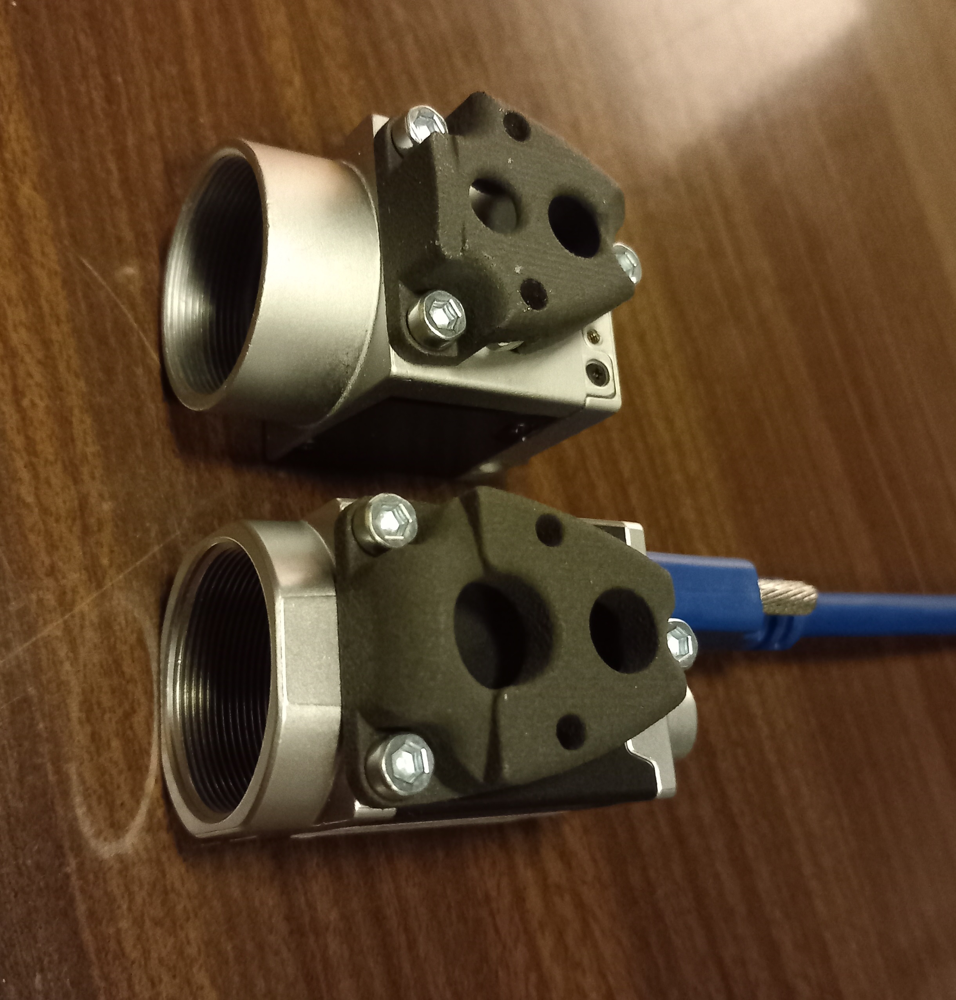

# HiSpeedAdaptorForPupilEXT - Repurposing an SMI HiSpeed tower-mounted eye-tracker to be used with PupilEXT open-source pupillometry software

***

As SensoMotoric Instruments GmbH was acquired by Apple Inc. in 2017, and support has been discontinued for their products, the previous users of their devices started to encounter problems with their devices, but noone left to help them. 

If you happen to be a researcher with a faulty SMI HiSpeed system, which is serving as a several thousand euro worth piece of paperweight at the moment, you might want to consider turning it into at least a working pupillometer device. It is possible to repurpose this tower mounted eye-tracker by replacing its camera and switching to use the open-source PupilEXT software for pupillometry! 

Here I assume though, that that the IR illumination of your system is intact.
The transformation is fully reversible (if you keep the original SMI-installed Windows on original SSD of the SMI host PC).


***

## Before you go with it

### There is an alternative

Importantly, Gaze Intelligence is another company formed by some of former SMI employees, who offer solutions to replace the old SMI devices, while keeping software integration compatibility. If anyone is interested, feel free to check them out first: https://gazeintelligence.com/

### Note on repairability of the built-in illuminator driver circuit 

The original SMI near-infrared (NIR) illumination driver circuitry is a very nicely repairable part of the system, so if you happen to have a problem with that, and have any interested electrics engineer student or any friend playing with DIY electronics, there is no need to worry. Accordingly, the repair details are not mentioned in detail here.

If you specifically have any problem with the NIR lighting, here below is a little help to find replacement parts for the driver circuit. The LED blocks are unlikely to malfunction, but can be repaired also, or swapped if only one block needs to stay operational. In case you wish to repair the driver circuitry, it is important you DO NOT CHANGE the state of the two blue square-shaped potentiometers on the printed-circuit-board, as they are for setting the brightness of the illuminators, and were factory-set to comply the EN 62471 eye-safety standard.


### Note on ethical and eye-safety compliance

The device after modification will not hurt the participants, or pose any threat to their comfort or health. Also, it should not affect EEG-compatibility, and as we have tested it already (using an USB3 interface camera), the modifications described below will not induce any electrophysiological recording noise in EEG, EMG or ECG recordings parallelly used with the system powered on. With the mentioned hardware modification of the HiSpeed tower mount, we change absolutely nothing with regard to the illuminator circuitry, which means that we do not introduce any change in the near-infrared illumination exposure to the participants' eyes, we only use the illuminators as they were produced in the SMI factory originally.

If you are to conduct research using the modified device, and you need to state the ethical compliance of the setup, you can just insert the following amendment text into your old/existing ethical approval application:
```
The eye movement activity of participants will be recorded during the experiment in a non-invasive manner, using an open-source system, which employs a camera manufactured by Basler (Basler AG, Ahrensburg, Germany), and the open-source PupilEXT software (B. Zandi, M. Lode, A. Herzog, G. Sakas, and T. Q. Khanh, “PupilEXT: Flexible Open-Source Platform for High-Resolution Pupillometry in Vision Research,” Front. Neurosci., vol. 15, Jun. 2021, doi: 10.3389/fnins.2021.676220).
The camera of the PupilEXT system is connected to the data recording computer via a safely sealed, electrically grounded cable, that it does not emit electromagnetic radiation to interfere with the operation of any other scientific appliance in the laboratory room. The camera is safely mounted inside a tower chin-rest structure, which is part of an older eye-tracker system from the manufacturer SMI (SensoMotoric Instruments GmbH, Teltow, Germany). The original camera unit from this SMI system was replaced by the aforementioned camera, to repurpose the device for use with the PupilEXT software. Importantly, the presence of this camera, and the powered state of this device does not cause any undesired electromagnetic interference with regard to pacemakers or human participants of the experiments. The camera does not emit light or near-infrared (NIR) radiation itself, but it uses the NIR illuminator units of the older SMI-system to ensure controlled lighting conditions for capturing monochromatic images of the eyes of the participants. This invisible light does not pose any threat to the heatlth of the participants.
```

And in case you are making image recordings of the eyes of the participants with the PupilEXT software, please add the following customisable text amendment to your "Declaration of informed consent" form that your participants always fill out:
```
I give my consent for the aforementioned party to record and store monochromatic images of my eyes, captured using an infrared video camera, to the aim of measuring my eye movement activity as part of this research. These images will be stored in an anonomized manner on protected computers for academic research purposes, and would be deleted whenever I choose withdraw my consent, now or anytime in the future.
```

At the same time, this instruction here is just a helping guide. All responsibility for your research will be yours for properly setting up and using these devices.

***

## Preparation

### What you will need

- Basler Ace or Ace 2 camera (Also described below)
- Compatible cable to connect your new camera to the PupilEXT host computer. If you are considering a high camera-to-computer distance, an active cable (i.e. power-supply-backed one) might be necessary
- Compatible lens with the chosen camera (Also described below)
- Screwdriver set with hex head bits
- 3D printed adapter part matching either the Ace or the Ace 2 camera mounting hole positions. (Strictly SLS-printed, not FDM. Also described below)
- Modeling superglue (e.g. 2g portion) 
- M3 hex nuts, 2 pcs (e.g. ISO 4032)
- M3x10 or M3x12, countersunk screws, 2 pcs (e.g. ISO 10642)
- M3x6 socket head cap screw, 3 pcs (e.g. ISO 4762)
- SSD to install a newer operating system on, which is supported by PupilEXT (optional, but recommended). Or as an alternate option, you can use a completely separate computer

### Obtaining PupilEXT

See the official software version at https://github.com/openPupil/Open-PupilEXT, or for an Experimental-Community-Version please also see the specific branch of the repository, or for its development version, see the GitHub fork here: https://github.com/sasfog/Open-PupilEXT.

*Important: to receive trial increments and messages to mark trigger timestamps and use several other features that might come handy for psychophysiology experiments, you need to install an Experimental-Community-Version release of the PupilEXT software.*

### Choosing the camera

You will need an industrial camera, which is (at the moment of writing this article) from the manufacturer Basler, compatible with the PupilEXT software. Recommended to choose a GigE interface version if the distance of the tower unit and the PupilEXT data recording computer is in 5 m or more of cable length. If less, you can use the USB3 vision interfaced cameras from Basler - however in this case it might be needed to also add an active (i.e. power-supply backed) cable to connect the host PC to the camera inside the tower unit, as USB cables have higher loss on supplied power to the camera. E.g. recommended is the Basler Ace aca2040-200um/gm, or Basler aca2040-90um/gm or aca1300-200um/gm or the Basler a2a1920-160um/gm.

Note that if you choose a GigE vision camera, you will occupy the single Ethernet port of the PupilEXT computer. So in order to be able to receive trigger timestamps (only available in the Experimental-Community-Version releases of the PupilEXT software)

Also note that if you use an USB3 cable to connect the camera to the data recording computer, the USB3 controller adaptor inside the computer probably (unlikely, but rarely) be too slow or provides insufficient power to the camera to function properly. If this is the case, you need to also obtain any other USB3 extension card to your PC (e.g. any Delock branded one will do) and plug that in, to connect the camera.


### Choosing the lens

The stock lens that came with the SMI HiSpeed system is likely a Tamron one with a pre-set focal length, and with focus left adjustable.
Be sure to choose a kind of lens that does not have a near-infrared(NIR)-blocking coating on its glass. You do not necessarily have to buy NIR-specialized lens, as they are likely very pricey and have mostly advancements in reduced vignetting, lens distortion or chromatic aberration, but as we are operating in a narrow spectral range of illumination here, and the pupil of the participant will likely stay in the middle part of the image throughout the eye recording, it is safe to go with any lens that does not bother the 850-1000 nm spectral range of light.

You will need compatible machine vision lens, that fit the Basler camera you chose. It likely should be a C-mount lens. Optimal focal distance will depend on the actual camera you buy. The stock camera lens that you can dismount from the JAI camera of the SMI system will perhaps work with your Basler camera, but it will likely be suboptimal regarding its focal length or other properties.
On Ebay you can easily find even used good quality machine vision lenses, often marketed as "TV lens" from good manufacturers like: Edmund Optics, Ricoh, Fujinon, Kowa, Computar, Tamron, VS Technology, Pentax. Cheap knockoff lenses marketed unbranded or noname, will also often work well, only probably lens distortion would be slightly higher.

As NIR filter, you can either just unscrew the NIR filter that was in the original JAI camera of the SMI HiSpeed system, behind the lens, unside the camera housing. It is a C-mount intermittent lens, that needs to be unscrewed using a tweezer or a rectangular piece of metal sized ~24 mm on one side, then can be screwed into your new Basler camera, to lay between the lens and the sensor. Or you can just buy a filter that fits the filter thread diameter of your chosen lens. If you seek to buy lens, Schneider-Kreuznach (EU) or MidOpt (US) are research-grade quality producers of optical filters, but even cheap Ebay, Amazon or Aliexpress finds can sometimes be surprisingly good, pick as you wish. Be sure to choose a long-pass/IR-pass filter with cut-on wavelength of anything between circa 680 and 870 nm, likely 720 or 850 is the easiest to find.


The focus of your chosen lens will probably need to be adjusted sometimes. This is slightly inconvenient, as the lens you use likely has a focus setting ring at a different location than where the original SMI lens had their one. So you cannot just use the tuner knob anymore, but anytime you want to change focus, you will need to quickly take town the lid of the tower mount, and tune focus, and then put the lid back on. However, this maneuver might only be necessary for a few exceptional subjects as the tower mount itself acts as a good chin rest and if the cheek and forehead of the participant are touching its surface, likely the same focus is applicable to almost everyone. Importantly, you can broaden the depth of field by lowering the aperture (setting the F number higher) on the lens. This is what you need to take care of. Be sure to place back the lid on the unit once you are all set, to prevent the participant from accidentally touching it (altough all touchable metal parts are grounded, so there is practically zero chance of electric shock for them).
If you happen to have your focus ring surprisingly at the same location where the slits of the tower head unit lid are located by chance, you can consider using lens ring lock screw extender, or just buy a longer screw and you can make your life easier. Typical lens ring locking screws are just regular knurled metric screws with one of the following thread sizes: M1.2, M1.4, M1.6, or M2. The exact type you need to find out by measuring this on your existing lens screws or consulting the lens documentation.

If you do not know what lens to choose, and cannot find anyone to help choosing the right lens, you can just choose to buy a variable focal length lens (varifocal lens, or "zoom" lens). But note that these usually have a limited F-value setting, so the image brightness vs. depth-of-field tradeoff would have to be considered: ultimately the image would be a little darker and slightly noisier, or it will be slightly harder to keep the pupil in focus when participants move.

### For example

In our lab we use a Basler a2a1920-160umBAS camera, with 12-36 mm varifocal lens, constantly set to 36 mm now, and f/4 aperture, and equipped with a 720 nm cut-on wavelength filter. In PupilEXT (Experimental-Community-Version release) we currently use the camera with 2x binning, and at 50 FPS to record images. Exposure is 10000 µs and analog gain of 15 dB. With the mentioned settings it produces the following image:


### The 3D printable adapter

You need an adapter element that will make your selected Basler camera fit in the tower assembly, particularly inside the machined aluminium cage inside the tower head unit. The old JAI camera was quite big (50.8x50.8 mm), but the Basler cameras will be smaller (29x29 mm). Also, the mounting hole positions differ, as the JAI one was mounted with two screws, but Baslers employ 3, in a different constellation.




*You can find the SLS 3D-printable parts modeled here in this repository.*   

[For Basler Ace series cameras](https://raw.githubusercontent.com/kheki4/HiSpeedAdaptorForPupilEXT/master/SMI_HiSpeed_Basler_ace_adaptor_n.stl)

[For Basler Ace 2 series cameras](https://raw.githubusercontent.com/kheki4/HiSpeedAdaptorForPupilEXT/master/SMI_HiSpeed_Basler_ace2_adaptor_n.stl)

Choose the one you need, either for Basler Ace or Ace 2 (or any other cameras of Basler, given it fits the same 3 mouting holes). Once printed, adding two M3 hex nuts and gluing them with a little amount of super glue, will be necessary to mount your new camera with the adapter into the SMI tower unit.

Specifically SLS-printing of the 3D part is necessary, beacuse as the camera can get very hot during use, an FDM-printed camera holder could deform in the heat.

Even though less widespread than FDM, SLS-printing is super easy and cheap in this size and quantitiy. I recommend either JLCPCB or PCBWay, but other companies also exist all around the globe, that support printing a little part like what we need, for likely around 1-2 USD (as of 2025, plus VAT and shipping).

At JLCPCB or PCBWay, you can just upload the needed .STL file to the online inquiry page, select SLS as printing method with any basic SLS material, and place the order! It is that easy, 5 minutes.

## Instructions

After you obtained all necessary components, to repurpose your system for use with PupilEXT, you need to follow these instructions:

1, Install PupilEXT on any compatible computer with a supported operating system, according to the walkthrough available on its GitHub page. You can use any computer you wish, but given you have the SMI host PC of the dead SMI HiSpeed system, it is logical to just try installing PupilEXT on it. This tutorial assumes that you go that way. But (at the moment of writing this article) PupilEXT does not have support for 32bit operating systems, so you cannot just install it on the stock SMI host PC. So, you need to either:  
- equip your former SMI host PC with a new SSD and install a PupilEXT compatible platform OS onto it (Windows 7 x64 recommended, but Linux or Mac is also possible), or   
- you can also just rewrite the factory-included SSD containing Windows 7 x86 with an x64 version as a new installation, although it might still be useful sometime, if you keep the original SMI installed system on it untouched, so the former option is recommended. 

2, In the observer room, unplug the CameraLink cable from the PC that goes to the HiSpeed tower mount in the experiment room, as it will no longer be needed. But keep the 12 v power supply attached, as it is needed to feed the IR illuminator of the tower mount unit. Pull out only the power cord of the power supply, for the duration of this tutorial.

3, In the experiment room, we will now partly disassemble the tower mount unit. Be sure to remove the dichroic "hot" mirror from the assembly first, by sliding it upwards. This mirror is used to reflect the invisible ~910-940 nm NIR light from the illuminator to the head of the participant and project the image of the eyes back to the camera. A mirror like this one is extremely hard to obtain and very expensive, so handle it with utmost care.


4, The structure of the tower mount is MJF-printed plastic, which is surprisingly flexible, but please try to handle it softly to avoid any cracks.
Lift up the smaller lid of the tower head enclosure, facing the cables/monitor, which will just snap out easily.
Now remove the larger lid on the tower head enclosure (the one that has a nice SMI sticker on it from the side of the participant), by tilting it and pulling gently to the direction opposite of the experiment PC monitor. It should easily snap out, then you can lift it in a tilted position to remove from the tower assembly.


5, Now we will remove the old JAI RM-6740CL camera of the SMI system.
You need to remove the CameraLink cable, by unscrewing its two little screws and pulling its end from the camera. Also please unplug the 12pin HiRose (mushroom-like looking) connector that feeds the camera with 12 v power. The connector only needs to be pulled, not rotated. The other end of the HiRose cable could also be disconnected from the IR power board, but it is not easy to access without further disassembling the structure, so you can just leave the end of the connector hanging there freely, without jamming any of the mechanical parts of the camera angle adjustment assembly of the tower head.
Do not unplug the 90 deg 4 pin connector that supplies 12 v power to the entire tower head unit (marked with "12 v" sticker), as this is needed later to feed the illuminator driver circuit.
Unscrew the lens from the camera, and remove the focus setter extender pin/knob/screw from its side if necessary.
Now unscrew the two black socket head countersunk M3 screws that hold the camera in its aluminium cage (these screws cannot later be used to screw in our new camera, as they would be too short). Now you can remove the camera by sliding it upwards, out of its cage.


6, Now we prepare the camera to be assembled into the tower mount. First fit the two M3 nuts into the 3D-printed adapter part, if you have not done already. The location of the nuts is shown below.


7, Now screw the camera onto the 3D-printed adapter part, using the three socket head cap M3 screws with 6 mm length. Now screw the camera into the aluminium cage inside the tower head unit, using the two countersunk M3 screws that you have, driving it through the cage, and the adapter, to screw them into the two hex nuts that are on the inside of the adapter part.


8, Screw the lens into the camera. If you have a filter to be screwed onto the lens, fit that as well.

9, Screw in the USB3 port or alternatively/depending on your camera model, insert the Ethernet cable to the GigE port of your camera, and connect it with the host PC that has the PupilEXT software installed. 

The example pictures below show a Basler Ace series camera (top two; Basler aca1300-200um) and a Basler Ace 2 series camera (bottom two; Basler a2A1920-160umBAS) mounted into the tower assembly.


10, Now place back the bigger lid and the smaller lid into the tower mount assembly to cover the cables and ensure that unwanted light from the ceiling of the experimental room will not be reflected to the face of the participant from the dichroic mirror by chance. 

11, Carefully place back the dichroic mirror to the tower mount structure. Be sure to fit it with the correct side facing the participant's face (its first-mirror surface, which is marked by a tiny triangluar chamfer on the bottom left side of the mirror, matching a tiny triangular notch on the left bottom of the transparent holder slides).

12, Replug the power supply of the system to mains in the observer room. Now you are free to switch on the IR light of the tower mount unit, and open the Basler camera with PupilEXT to make recordings of the pupil!

***

## Serving suggestion

The IR illumination of the SMI HiSpeed system is designed in a way that there are 2 light emitters inside the tower head. If the camera is in the middle position, all 2 illuminators will operate when the system is powered on. But if the camera is shifted to the right-eye or the left-eye, only the corresponding one illuminator will stay on. This kind of operation (i.e. only lighting and recording one eye) is highly recommended, as a single corneal reflection trace ("glint") of the illuminator will be much easier for the pupil-detection algorithm of PupilEXT to filter out, than 2 traces. Moreover, if just one eye is recorded, the pupil can be kept in the center of the camera image easily, which reduces pupil data artefacts originating from mainly uneven lighting, vignetting and lens distortion. You can adjust the camera to the left or right using the adjustment knob on the outside of the tower head. 

Of course, once you are using the image of one eye only, it is beneficial to choose a lens that allows a zoomed-in view of one eye. If you chose a varifocal lens, this just means to set the focal distance to your liking and lock it there. 
Importantly, one possible downside of using a varifocal lens is that, once its focal distance ("zoom") is changed, the size of the pupil will go with it, and also the quantization error of the real vs. image-captured pupil. So at least a dummy-eye recalibration or other control is needed for these changes, as well as a new lens calibration if you use that feature in PupilEXT. Still it is completely okay to use a varifocal lens, if you are sure that you will not change the zoom between experimental conditions, or participants. Below you can see the difference in a binocular and monocular constellation.


***

## Additional note

Author: Gábor Bényei @ BUTE

License: CC BY-NC-SA

The 3D-printable models used here were created with Autodesk Inventor 2024. The models and any derivative work should be used for non-commercial, research/education purposes only.
